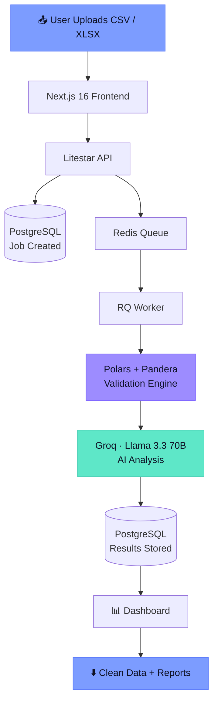

<div align="center">



<br/>


<br/><br/>

### Streaming transaction validation at scale.

*Upload messy multi-country transaction data. Get back clean datasets, error reports, and AI-generated insights — automatically.*

<br/>

[](https://github.com/Devanshu11976/stratos)
[]()
[]()

</div>

<br/>

---

<br/>

## 🌐 What is Stratos?

Organizations pull transaction data from dozens of sources and countries — and that data always arrives messy. Broken phone numbers, inconsistent date formats, missing fields, duplicate IDs, invalid payment modes. Cleaning it by hand doesn't scale.

**Stratos** is a layered, streaming validation pipeline. Drop in a CSV or XLSX file, and it flows down through every layer of the stack — schema checks, country-specific rule validation, async background processing, and an AI reasoning layer — emerging as a clean dataset, a detailed error report, and a plain-English quality summary.

Every layer in the name is intentional: Stratos validates **in layers**, the same way the atmosphere itself is layered — from raw upload down to AI-refined insight.

<br/>

## ✨ Core Capabilities

<table>
<tr>
<td width="33%" valign="top">

### 🔎 Validation Engine
- Country-specific phone & payment-mode rules
- Email, date, time, currency checks
- Required-field & schema validation
- Duplicate transaction/order detection
- Negative quantity / amount checks

</td>
<td width="33%" valign="top">

### 🧠 AI Insights Layer
- Data quality scoring
- Executive summaries in plain English
- Root-cause error analysis
- Country-wise breakdowns
- Actionable recommendations

</td>
<td width="33%" valign="top">

### ⚡ Built for Scale
- Streaming validation with Polars
- Async background workers
- Redis-queued job processing
- Auto-chunked output files
- Horizontally scalable workers

</td>
</tr>
</table>

<br/>

## 🏗️ How a File Flows Through Stratos



<br/>

## 🧬 The Stack, Layer by Layer

<div align="center">

| Layer | Technology | Purpose |
|:---|:---|:---|
| 🎨 **Frontend** | Next.js 16, TypeScript, React | Upload UI, live dashboard, report downloads |
| 🚪 **API** | Litestar, msgspec | High-performance request handling |
| 🛡️ **Validation** | Polars, Pandera | Schema + rule-based data validation |
| 📨 **Queue** | Redis, RQ | Background job orchestration |
| ⚙️ **Worker** | Python (RQ worker) | Executes validation & report generation |
| 🗄️ **Database** | PostgreSQL + SQLAlchemy (async) | Jobs, rules, logs, AI reports |
| 🤖 **AI** | Groq API — Llama 3.3 70B | Quality scoring, summaries, recommendations |
| 📚 **Docs** | OpenAPI / Swagger | Live API reference at `/api/docs` |

</div>

<br/>

## 🚀 Quick Start

### Run everything at once
```bash
npm install
npm run dev
```
This spins up PostgreSQL, Redis, the API, and the worker via Docker — plus the Next.js frontend.

| Service | URL |
|---|---|
| App | http://localhost:3000 |
| API | http://localhost:8000 |
| API Docs | http://localhost:8000/api/docs |

### Run backend only
```bash
cd backend
cp .env.example .env          # set DB_PASSWORD and GROQ_API_KEY
docker compose up --build -d
```

### Run frontend only
```bash
cd xeno-data-hub
npm install
cp .env.example .env.local    # set NEXT_PUBLIC_API_URL if API is remote
npm run dev
```

> 💡 In local dev, `/api/*` is automatically proxied to `http://localhost:8000` — you only need `NEXT_PUBLIC_API_URL` when the API lives elsewhere.

<br/>

## 📊 What Comes Out the Other Side

<table>
<tr>
<td width="50%" valign="top">

**📁 Clean Dataset**
Only the records that passed every check — ready to load downstream.

**🧾 Error Report**
Every failed record, paired with *why* it failed and which category it falls under.

</td>
<td width="50%" valign="top">

**📦 Chunked Outputs**
Large files auto-split into manageable pieces (`chunk_1.csv`, `chunk_2.csv`, …).

**🧠 AI Insights Report**
Executive summary, quality score, country analysis, and next-step recommendations — generated by Llama 3.3.

</td>
</tr>
</table>

<br/>

## 🌍 Country-Aware by Design

Validation rules flex per country instead of forcing one global format:

```
🇮🇳 India       → 10-digit phone · UPI, CARD, NETBANKING, CASH, WALLET
🇸🇬 Singapore   → 8-digit phone  · PAYNOW, NETS, GRABPAY
🇺🇸 USA         → 10-digit phone · standard card/ACH modes
```

New countries and rule sets plug in without touching the core engine.

<br/>

## 🔭 What's Next

- [ ] Real-time validation (Kafka)
- [ ] Multi-tenant architecture
- [ ] S3-backed storage
- [ ] ML-based anomaly detection
- [ ] Data lineage tracking
- [ ] Role-based access control + audit logs

<br/>

---

<div align="center">

### Built by **Devanshu Sharma & Sanmati Jain**
BE Computer Science Engineering (AI & ML) · Chandigarh University

*Originally built for the Xeno Implementation Internship Assignment.*

<br/>

<sub>⭐ If Stratos is useful to you, consider starring the repo.</sub>

</div>
